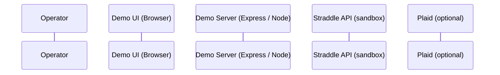

---

## 0. Demo Story (how you narrate this at NerdCon)

You’re showing how Straddle collapses the “fintech stack” into one API:

1. **Left side (Terminal + API log)** –
   You drive a CLI‑style prompt:

   ```text
   /create-customer
   /review-customer
   /link-account plaid
   /create-charge --amount 5000 --outcome paid
   ```

   Each command fires real HTTP calls to a **Node/Express demo server**, which in turn calls **Straddle sandbox** via the Straddle Node SDK.

2. **Right side (Mini dashboard)** –
   Live “status cards” and a “pizza tracker” update as webhooks come in:

   * **Customer card** – KYC status (`pending/review/verified/rejected`), reason codes from `GET /v1/customers/{id}/review`. ([Straddle Docs][2])
   * **Paykey card** – institution, last4, `status` + `status_details` (owns the account, verified by WALDO). ([Straddle Docs][3])
   * **Charge card** – amount, balance_check config, sandbox_outcome, payment rail. ([Straddle Docs][4])
   * **Risk & review panel** – shows identity and paykey review decisions (customer + paykey review endpoints).
   * **Pizza tracker** – stages from `created → scheduled → pending → paid/failed/reversed/cancelled` driven by `charge.created.v1` and `charge.event.v1` webhooks. ([Straddle Docs][5])

You narrate: *“Normally you’d stitch together KYC, open banking, risk, ACH gateway, webhooks, and a ledger. Here it’s one API client and a set of review & payment endpoints.”*

The implementation below makes that real.

---

## 1. High‑Level Architecture

Based on your Mermaid diagram:



**Components:**

1. **Demo UI (Browser)** – React + TypeScript + Vite

   * Left: Terminal + inline API Request Log
   * Right: Mini dashboard (cards + pizza tracker)

2. **Demo Server (Express / Node)**

   * Uses **`@straddlecom/straddle`** Node SDK only on the server. 
   * Exposes **thin, demo‑specific endpoints** the UI calls:

     * `POST /customers`
     * `GET /customers/:id/review`
     * `PATCH /customers/:id/decision`
     * `POST /bridge/plaid`
     * `POST /bridge/bank-account`
     * `GET /paykeys/:id/review` (via `client.paykeys.review`) 
     * `POST /charges`
     * `GET /charges/:id`
     * `GET /state` (current customer/paykey/charge snapshot)
     * `GET /events/stream` (SSE/WebSocket for webhook updates)

3. **Straddle Sandbox**

   * Identity: `POST /v1/customers`, `GET/PATCH /v1/customers/{id}/review` ([Straddle Docs][2])
   * Bridge: `POST /v1/bridge/plaid`, `POST /v1/bridge/bank_account`, `POST /v1/paykeys` ([Straddle Docs][6])
   * Pay by Bank: `POST /v1/charges`, `GET /v1/charges/{id}` ([Straddle Docs][4])
   * Review & risk: `GET /v1/customers/{id}/review`, `PATCH /v1/customers/{id}/review`, `PATCH /v1/paykeys/{id}/review` ([Straddle Docs][2])
   * Webhooks: `charge.created.v1`, `charge.event.v1` for lifecycle. ([Straddle Docs][5])
   * Sandbox simulation via `config.sandbox_outcome`. ([Straddle Docs][7])

4. **Plaid (optional)**

   * Provided as a **given** Plaid processor token for Straddle, coming from your sandbox setup. Straddle’s Plaid integration docs cover the Straddle‑side usage. ([Straddle Docs][6])

---

## 2. Repositories & Tech Stack

Single mono‑repo:

```text
straddle-nerdcon-demo/
  server/        # Express + Node SDK
  web/           # React + Vite demo UI
```

### Server

* **Runtime**: Node 20+ 
* **Language**: TypeScript
* **Key deps**:

  * `@straddlecom/straddle` – official SDK
  * `express`, `body-parser`
  * `uuid` – Request‑Id, Correlation‑Id, Idempotency‑Key
  * `dotenv`
  * `pino` (or console) for logs

### Web

* **Framework**: React + TypeScript + Vite 
* **UI**: Tailwind + shadcn/ui
* **State**: Zustand (or React Query + local store)
* **Transport**: Fetch for REST + EventSource/WebSocket for webhook stream

---

## 3. Environment & Configuration

### 3.1 Server `.env.example`

```bash
# Straddle Sandbox
STRADDLE_API_KEY=sk_sandbox_...
STRADDLE_ENV=sandbox

# Optional account scope for platforms
STRADDLE_ACCOUNT_ID=<uuid_optional>

# Optional Plaid processor token (if you want one-click demo)
PLAID_PROCESSOR_TOKEN=processor-sandbox-...

# Webhook secret for validating Straddle webhooks (if configured)
STRADDLE_WEBHOOK_SECRET=<optional>
```

Straddle docs show using `sandbox.straddle.io` / `sandbox.straddle.com` with Bearer API keys; the SDK hides base URLs behind the `environment` option. ([Straddle Docs][1])

### 3.2 Web `.env.example`

```bash
VITE_SERVER_BASE_URL=http://localhost:4000
```

No Straddle keys in the browser.

---

## 4. Demo Server Design (Express + Node SDK)

### 4.1 SDK client factory

Use the SDK per its README:

```ts
// server/src/straddleClient.ts
import Straddle from '@straddlecom/straddle';

export function createClient() {
  return new Straddle({
    apiKey: process.env.STRADDLE_API_KEY!,
    environment: process.env.STRADDLE_ENV === 'production' ? 'production' : 'sandbox',
    // optional: logLevel: 'debug',
  });
}
```

### 4.2 Request metadata helper (Request‑Id / Correlation‑Id / Idempotency‑Key)

Follow Straddle docs for RequestId and Idempotency: ([Straddle Docs][8])

```ts
// server/src/headers.ts
import { v4 as uuid } from 'uuid';

export function buildHeaders(correlationId?: string) {
  const correlation = correlationId ?? uuid();
  return {
    'Request-Id': uuid(),
    'Correlation-Id': correlation,
    'Idempotency-Key': uuid().slice(0, 36), // ensure 10–40 chars
  };
}
```

Every **state‑changing** call (POST/PATCH) from the server to Straddle should include these headers.

### 4.3 In‑memory demo state

```ts
// server/src/state.ts
export interface DemoState {
  customerId?: string;
  paykeyId?: string;
  chargeId?: string;
  events: Array<{
    type: 'customer' | 'paykey' | 'charge' | 'webhook';
    payload: any;
    at: string; // ISO
  }>;
}

export const state: DemoState = {
  events: [],
};
```

### 4.4 Routes (mapping your Mermaid sequence)

#### 4.4.1 POST /customers

Flow: UI → API → Straddle `POST /v1/customers` → UI, as in Mermaid.

Implementation outline:

```ts
// server/src/routes/customers.ts
import express from 'express';
import { createClient } from '../straddleClient';
import { buildHeaders } from '../headers';
import { state } from '../state';

const router = express.Router();

router.post('/', async (req, res, next) => {
  try {
    const client = createClient();
    const headers = buildHeaders();

    const body = req.body; // name, type, email, phone, address, device.ip_address, optional config.sandbox_outcome

    const { data: customer } = await client.customers.create(body, { headers });

    state.customerId = customer.id;
    state.events.push({ type: 'customer', payload: customer, at: new Date().toISOString() });

    res.json({ customer, headers });
  } catch (err) {
    next(err);
  }
});
```

Docs: `POST /v1/customers` and identity behavior. ([Straddle Docs][2])

#### 4.4.2 GET /customers/:id/review and PATCH /customers/:id/decision

Map UI calls to Straddle’s review endpoints: `GET /v1/customers/{id}/review`, `PATCH /v1/customers/{id}/review`. ([Straddle Docs][2])

```ts
router.get('/:id/review', async (req, res, next) => {
  try {
    const client = createClient();
    const { data: review } = await client.customers.review.get(req.params.id);
    res.json({ review });
  } catch (err) {
    next(err);
  }
});

router.patch('/:id/decision', async (req, res, next) => {
  try {
    const client = createClient();
    const { status } = req.body; // e.g. 'verified' | 'rejected'
    const { data: customer } = await client.customers.review.decision(req.params.id, { status });
    res.json({ customer });
  } catch (err) {
    next(err);
  }
});
```

On the **right‑hand dashboard**, this fuels:

* “Identity & KYC” card (status, reason, identity breakdown if returned).
* “Manual decision” UI (button that calls `/customers/:id/decision` to push a `review` → `verified` decision).

#### 4.4.3 POST /bridge/plaid

Use the Node SDK’s Bridge → Link → Plaid helper: `client.bridge.link.plaid`.

```ts
// server/src/routes/bridge.ts
router.post('/plaid', async (req, res, next) => {
  try {
    const client = createClient();
    const headers = buildHeaders(req.body.correlationId);

    const customerId = state.customerId ?? req.body.customer_id;
    const plaidToken = req.body.plaid_token ?? process.env.PLAID_PROCESSOR_TOKEN;

    const { data: paykey } = await client.bridge.link.plaid(
      { customer_id: customerId, plaid_token: plaidToken, metadata: { source: 'nerdcon-demo' } },
      { headers },
    );

    state.paykeyId = paykey.id;
    state.events.push({ type: 'paykey', payload: paykey, at: new Date().toISOString() });

    res.json({ paykey, headers });
  } catch (err) {
    next(err);
  }
});
```

This maps to your diagram step: “Use Straddle Bridge to turn Plaid token into paykey with ownership & name match.”

#### 4.4.4 POST /bridge/bank-account

Show the **non‑Plaid path** via `client.bridge.link.bankAccount`, matching sandbox simulation docs:

```ts
router.post('/bank-account', async (req, res, next) => {
  try {
    const client = createClient();
    const headers = buildHeaders(req.body.correlationId);

    const customerId = state.customerId ?? req.body.customer_id;
    const { account_number, routing_number, account_type, sandbox_outcome } = req.body;

    const { data: paykey } = await client.bridge.link.bankAccount(
      {
        customer_id: customerId,
        account_number,
        routing_number,
        account_type,
        config: sandbox_outcome ? { sandbox_outcome } : undefined,
      },
      { headers },
    );

    state.paykeyId = paykey.id;
    state.events.push({ type: 'paykey', payload: paykey, at: new Date().toISOString() });

    res.json({ paykey, headers });
  } catch (err) {
    next(err);
  }
});
```

#### 4.4.5 GET /paykeys/:id/review

Straddle’s Node SDK exposes paykey review as `client.paykeys.review(id, { ... })` (PATCH) and `client.paykeys.get` for status; you can use both to drive your paykey risk card.

For the demo, **read‑only** review is enough:

```ts
router.get('/paykeys/:id/review', async (req, res, next) => {
  try {
    const client = createClient();
    const { data: paykey } = await client.paykeys.get(req.params.id);
    res.json({ paykey });
  } catch (err) {
    next(err);
  }
});
```

You can later add `PATCH /paykeys/:id/review` mapped to `client.paykeys.review(id, { status: 'active' | 'inactive' | ... })` if you want to show manual review for paykeys too.

#### 4.4.6 POST /charges

Use `client.charges.create` with `config.sandbox_outcome` to drive deterministic pizza‑tracker behavior.

```ts
// server/src/routes/charges.ts
router.post('/', async (req, res, next) => {
  try {
    const client = createClient();
    const headers = buildHeaders(req.body.correlationId);

    const paykey = req.body.paykey ?? state.paykeyId && (await client.paykeys.get(state.paykeyId)).data.paykey;

    const { amount, sandbox_outcome } = req.body;

    const { data: charge } = await client.charges.create(
      {
        paykey,
        amount: amount ?? 5000, // $50 default
        currency: 'USD',
        description: 'NerdCon Demo Charge',
        payment_date: new Date().toISOString().slice(0, 10),
        consent_type: 'internet',
        device: { ip_address: '192.168.1.1' },
        external_id: `nerdcon_${Date.now()}`,
        config: {
          balance_check: 'enabled',
          sandbox_outcome: sandbox_outcome ?? 'paid',
        },
      },
      { headers },
    );

    state.chargeId = charge.id;
    state.events.push({ type: 'charge', payload: charge, at: new Date().toISOString() });

    res.json({ charge, headers });
  } catch (err) {
    next(err);
  }
});
```

#### 4.4.7 GET /charges/:id

Simple status polling (used when opening the pizza tracker page):

```ts
router.get('/:id', async (req, res, next) => {
  try {
    const client = createClient();
    const { data: charge } = await client.charges.get(req.params.id);
    res.json({ charge });
  } catch (err) {
    next(err);
  }
});
```

#### 4.4.8 Webhooks → UI events

Straddle sends `charge.created.v1` and `charge.event.v1` events; use a webhook endpoint to capture them and push into a server‑side event stream. ([Straddle Docs][5])

```ts
// server/src/routes/webhooks.ts
router.post('/straddle', express.raw({ type: 'application/json' }), (req, res) => {
  // Optionally validate signature with STRADDLE_WEBHOOK_SECRET

  const event = JSON.parse(req.body.toString());
  if (event.type.startsWith('charge.')) {
    state.events.push({ type: 'webhook', payload: event, at: new Date().toISOString() });
    // Fan out to SSE / WebSocket clients
    notifier.broadcast(event);
  }

  res.status(200).send('ok');
});
```

Then expose `GET /events/stream` as SSE:

```ts
router.get('/events/stream', (req, res) => {
  res.setHeader('Content-Type', 'text/event-stream');
  res.setHeader('Cache-Control', 'no-cache');
  res.flushHeaders();

  const clientId = notifier.addClient(res);
  req.on('close', () => notifier.removeClient(clientId));
});
```

The UI listens and updates the pizza tracker as states change (`created`, `scheduled`, `pending`, `on_hold`, `paid`, `failed`, `reversed`, `cancelled`). ([Straddle Docs][9])

#### 4.4.9 GET /state

For quick hydration of the right‑side dashboard:

```ts
router.get('/state', (req, res) => {
  res.json(state);
});
```

---

## 5. Web App Design (split‑screen NerdCon layout)

### 5.1 Layout

```text
+------------------------------------------------------------+
| Left: Terminal + API Log | Right: Mini Dashboard           |
+--------------------------+---------------------------------+
```

**Left column (40–45% width)**

1. **Terminal panel**

   * Accepts commands:

     * `/create-customer`
     * `/review-customer`
     * `/link-account plaid`
     * `/link-account bank --outcome active`
     * `/create-charge --amount 5000 --outcome paid`
     * `/create-charge --outcome cancelled_for_fraud_risk`
     * `/status`
     * `/clear`, `/reset`
   * Each command:

     * Parses args.
     * Calls the corresponding server route.
     * Prints:

       * High‑level message.
       * Key IDs (customer_id, paykey_id, charge_id).
       * Relevant status & sandbox_outcome.

2. **API request log**

   * Small table under the terminal:

     * Time
     * Method / path
     * Straddle endpoint (from server response)
     * Request‑Id, Correlation‑Id, Idempotency‑Key
     * Status code
   * This is **not** mock data: you read it from the server response that includes `headers` we returned.

**Right column (55–60% width)**

1. **Customer card – Identity & KYC**

   * Title: “Customer”
   * Fields:

     * `name`, `email`, `phone`
     * `status` (pending / review / verified / rejected / inactive) ([Straddle Docs][2])
     * Score / reasons from `GET /customers/{id}/review` where available.
   * If status=`review`, show a button:

     * “Approve” → calls `/customers/:id/decision { status: 'verified' }` and updates the card.

2. **Paykey card – Account ownership**

   * Title: “Paykey”
   * Fields:

     * institution_name, label (e.g. `CHASE BANK - *7890`)
     * source (`plaid` or `bank_account`)
     * status (`pending`, `active`, `inactive`, `rejected`) ([Straddle Docs][10])
     * status_details.message / reason.
   * Show WALDO / ownership text from docs as explanatory subtitle. ([Straddle Docs][3])

3. **Charge card – Payment & balance**

   * Title: “Charge”
   * Fields from `ChargeV1`:

     * amount (formatted dollars)
     * currency, payment_date, payment_rail (if present) ([Straddle Docs][4])
     * status + status_details (reason, source)
     * config.balance_check (enabled/required) and sandbox_outcome used. ([Straddle Docs][4])
   * This is your “balance/risk” slice: you’re showing how Straddle pre‑screens and enforces limits.

4. **Risk & Review panel**

   * Combines:

     * Identity verification breakdown from customer review endpoint.
     * Paykey status_details (e.g. “Account successfully verified, reason: OK”). ([Straddle Docs][2])
   * Visual: list of checkmarks / warnings:

     * Identity verification
     * Watchlist / AML
     * Account ownership
     * Balance / limits

5. **Pizza tracker**

   * Horizontal stepper:

     * `created → scheduled → pending → paid` (happy path) plus branches `on_hold`, `failed`, `reversed`, `cancelled`. ([Straddle Docs][9])
   * Data source:

     * Initial state from `GET /charges/:id`.
     * Subsequent transitions from webhook stream events.
   * For sandbox demos:

     * `/create-charge --outcome paid`
     * `/create-charge --outcome cancelled_for_fraud_risk`
     * `/create-charge --outcome reversed_insufficient_funds`
     * `/create-charge --outcome on_hold_daily_limit` ([Straddle Docs][7])

---

## 6. Command Model (what the UI sends to the server)

Reusing your existing CLI commands, but now they call the **demo server** instead of Straddle directly from the browser.

* `/create-customer [--outcome verified|review|rejected]`

  * POST `/customers` with customer template + optional `config.sandbox_outcome`.
  * Prints ID + status.
* `/review-customer [verified|rejected]`

  * GET `/state` → current customer_id.
  * PATCH `/customers/:id/decision`.
* `/link-account plaid`

  * POST `/bridge/plaid`.
* `/link-account bank [--outcome active]`

  * POST `/bridge/bank-account`.
* `/create-charge [--amount <cents>] [--outcome <sandbox_outcome>]`

  * POST `/charges`.
* `/status`

  * GET `/state`; prints summary of IDs and statuses.
* `/clear`

  * Clears terminal + local UI log only.
* `/reset`

  * Calls a `POST /reset` on the server (optional) to wipe in‑memory state, plus clears UI.

---

## 7. Straddle Sandbox Test Data

Use documented sandbox patterns: ([Straddle Docs][6])

* **Customer:**

  ```ts
  {
    name: 'Alberta Bobbeth Charleson',
    type: 'individual',
    email: 'alberta.charleson@example.com',
    phone: '+12125550123',
    device: { ip_address: '192.168.1.1' },
    config: { sandbox_outcome: 'verified' },
  }
  ```

* **Paykey (bank-account path)**: `config.sandbox_outcome: 'active'`.

* **Charge**: `config.balance_check: 'enabled'`, `config.sandbox_outcome` from CLI flag.

This guarantees:

* Identity verification completes quickly.
* Paykey is usable instantly.
* Charge lifecycle is deterministic but still asynchronous, matching real behavior. ([Straddle Docs][7])

---

## 8. Implementation Steps for Claude Code

You can hand Claude Code something like:

1. **Bootstrap server**

   * Create `server/` with Express + TypeScript.
   * Install `@straddlecom/straddle`, `express`, `dotenv`, `uuid`.
   * Implement `straddleClient.ts`, `headers.ts`, `state.ts`.
   * Implement routes exactly as described:

     * `/customers`, `/customers/:id/review`, `/customers/:id/decision`
     * `/bridge/plaid`, `/bridge/bank-account`
     * `/paykeys/:id/review`
     * `/charges`, `/charges/:id`
     * `/state`, `/reset`
     * `/webhooks/straddle`, `/events/stream`

2. **Bootstrap web**

   * Create `web/` with React + Vite + TypeScript.
   * Add Tailwind + shadcn/ui, Zustand.
   * Implement:

     * `TerminalPanel` (command parsing + fetch calls)
     * `RequestLogPanel` (shows per‑command server metadata)
     * `MiniDashboard` with:

       * `CustomerCard`, `PaykeyCard`, `ChargeCard`, `RiskPanel`, `PizzaTracker`.
   * Wire `/events/stream` into `PizzaTracker` via EventSource.

3. **Wire everything**

   * On page load:

     * Call `/state` to hydrate dashboard.
     * Connect to `/events/stream`.
   * On each command:

     * Update terminal, log, and re‑fetch `/state`.

4. **Verify against Straddle**

   * Run server with a real sandbox API key.
   * Trigger `/create-customer → /link-account plaid → /create-charge --outcome paid`.
   * Confirm:

     * Customers, paykeys, charges appear in Straddle dashboard with matching IDs. ([Straddle Docs][4])
     * Webhooks fire and pizza tracker updates in real time.

---


[1]: https://docs.straddle.io/api-reference/sdk/node "Welcome to Straddle - Straddle Docs"
[2]: https://docs.straddle.io/guides/identity/customers?utm_source=chatgpt.com "Customers - Straddle Docs"
[3]: https://docs.straddle.io/guides/bridge/paykeys?utm_source=chatgpt.com "Paykeys - Straddle Docs"
[4]: https://docs.straddle.io/guides/payments/overview?utm_source=chatgpt.com "Overview - Straddle Docs"
[5]: https://docs.straddle.io/webhooks/overview/events?utm_source=chatgpt.com "Event Catalog - Straddle Docs"
[6]: https://docs.straddle.io/guides/bridge/plaid-token?utm_source=chatgpt.com "Plaid - Straddle Docs"
[7]: https://docs.straddle.io/guides/resources/sandbox-paybybank?utm_source=chatgpt.com "Sandbox Simulation Testing - Straddle Docs"
[8]: https://docs.straddle.com/api-reference/request-id?utm_source=chatgpt.com "Request ID - Straddle Docs"
[9]: https://docs.straddle.io/guides/payments/statuses?utm_source=chatgpt.com "Payment Status & Lifecycle - Straddle Docs"
[10]: https://docs.straddle.io/guides/glossary?utm_source=chatgpt.com "Glossary - Straddle Docs"
